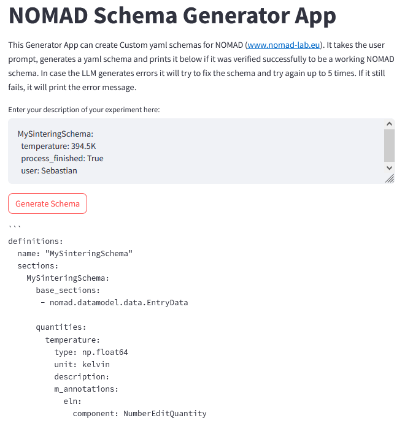

# llmnomadschemagenerator
# llmschemagen.py

`llmschemagen.py` is a Python application built with Streamlit. It's designed to generate a custmom yaml schema for [NOMAD](www.nomad-lab.eu) based on user input, rename the generated schema file, and provide a download link for the renamed file.

## Features

1. **Schema Generation**: The application takes user input and generates a schema based on it. The generated schema is validated by `nomad.client.parse` written to a YAML file named `output.schema.archive.yaml`.

2. **Schema Renaming**: The application parses the generated YAML file to extract the schema name. It then renames the `output.schema.archive.yaml` file to `{schema_name}.archive.yaml`.

3. **Schema Download**: The application provides a download button for the renamed schema file. When clicked, the `{schema_name}.archive.yaml` file is downloaded to the user's local machine.

## Usage

1. Run the application using Streamlit: `streamlit run llmschemagen.py`
2. Provide the necessary input for schema generation.
3. Click the 'Generate Schema' button to generate the schema. The generated schema will be displayed in the application.
4. Click the 'Rename Schema' button to rename the generated schema file.
5. Click the 'Download *.yaml' button to download the renamed schema file.
6. Upload the schema file to a NOMAD instance and generate structured ELN data

## Note

* We are using Llama3 provided by HU Berlin
* You need to be in the HU VPN to connect to the LLM

